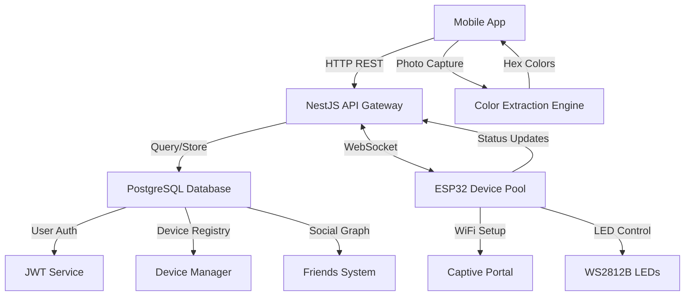

# PalPalette - IoT Color Sharing Platform

The original idea of this was to create a system that lets remote friends easily share moments with each other. The first version of this was created in the context of a university module. As there were deadlines to fullfill, our techstack was not optimal and the structure lacked... structure.

This second version seen here is the attempt to bring more structure and a better techstack to this project. But again, there were deadlines to fullfill (this time for a study using this system) and the second version had to be created rather quickly. Because of this it was decided to try to create the new system using AI support.

As many of you probably know, this can be rather chaotic at times. While some parts of this system are already working well, others are still chaotic and do not work as intended. In the near future human devs should take control back from the AI in this project, hopefully fixing what the AI could'nt.

As I'm neither an expert in C++, nor in NestJS, the AI created the code only with my supervision. I plan on learning these techs in the near future, to be able to further develop this on my own.

In the meantime, I invite everyone who has a better understanding of these technologies to refactor and expand this project :).

_The following readme was also created by the AI_

> **A revolutionary IoT ecosystem that bridges the digital and physical worlds through color**

PalPalette transforms how we share and experience colors by connecting mobile devices, cloud services, and physical LED displays. Extract colors from your world, share them with friends, and watch them come alive on beautiful LED installations in real-time.

## 🎯 Project Vision

In an increasingly digital world, PalPalette creates tangible connections through the universal language of color. Whether you want to share the sunset from your vacation, the cozy ambiance of your coffee shop, or simply brighten a friend's day with their favorite colors, PalPalette makes it possible with just a photo and a tap.

## ✨ What Makes PalPalette Special

- **🌈 Instant Color Magic**: Point, capture, extract, and share color palettes in seconds
- **🤝 Social Color Sharing**: Send colors to friends like sending messages
- **💡 Physical Manifestation**: Watch digital colors transform into beautiful LED displays
- **🔧 Zero-Configuration Setup**: ESP32 devices that set themselves up automatically
- **🌐 Real-Time Synchronization**: WebSocket-powered instant color delivery
- **📱 Cross-Platform Mobile**: Works on iOS and Android with native performance

## 🏗️ System Architecture

### High-Level Overview

```
┌─────────────────┐    ┌──────────────────┐    ┌─────────────────┐
│   Mobile App    │◄──►│   Backend API    │◄──►│  ESP32 Device   │
│ (Ionic/React)   │    │ (NestJS + WS)    │    │   (Arduino)     │
└─────────────────┘    └──────────────────┘    └─────────────────┘
       │                        │                        │
       │                        │                        │
   ┌───▼────┐              ┌────▼────┐              ┌────▼────┐
   │ Camera │              │Database │              │ WS2812B │
   │ Color  │              │(Postgres│              │   LED   │
   │Extract │              │ + JWT)  │              │ Display │
   └────────┘              └─────────┘              └─────────┘
```

### Detailed Component Architecture

```
┌─────────────────────────────────────────────────────────────────┐
│                        PalPalette System                        │
├─────────────────────────────────────────────────────────────────┤
│                          Frontend Layer                         │
│  ┌─────────────────┐  ┌─────────────────┐  ┌─────────────────┐ │
│  │   iOS App       │  │   Android App   │  │   Web Portal    │ │
│  │ (Ionic/Capacitor│  │ (Ionic/Capacitor│  │   (React)       │ │
│  │  + TypeScript)  │  │  + TypeScript)  │  │                 │ │
│  └─────────────────┘  └─────────────────┘  └─────────────────┘ │
├─────────────────────────────────────────────────────────────────┤
│                        API Gateway Layer                        │
│  ┌─────────────────────────────────────────────────────────────┐ │
│  │              NestJS Backend API Server                     │ │
│  │  ┌─────────┐ ┌─────────┐ ┌─────────┐ ┌─────────┐         │ │
│  │  │  Auth   │ │ Devices │ │Messages │ │  Users  │         │ │
│  │  │ Module  │ │ Module  │ │ Module  │ │ Module  │         │ │
│  │  └─────────┘ └─────────┘ └─────────┘ └─────────┘         │ │
│  └─────────────────────────────────────────────────────────────┘ │
├─────────────────────────────────────────────────────────────────┤
│                       Communication Layer                       │
│  ┌─────────────────┐              ┌─────────────────┐           │
│  │   REST APIs     │              │   WebSocket     │           │
│  │ (HTTP/HTTPS)    │              │   (Real-time)   │           │
│  │                 │              │                 │           │
│  │ • Authentication│              │ • Device Comms  │           │
│  │ • User Management│              │ • Color Sharing │           │
│  │ • Device Setup  │              │ • Live Updates  │           │
│  └─────────────────┘              └─────────────────┘           │
├─────────────────────────────────────────────────────────────────┤
│                         Data Layer                              │
│  ┌─────────────────────────────────────────────────────────────┐ │
│  │                PostgreSQL Database                          │ │
│  │  ┌─────────┐ ┌─────────┐ ┌─────────┐ ┌─────────┐           │ │
│  │  │  Users  │ │ Devices │ │Messages │ │Palettes │           │ │
│  │  │  Table  │ │  Table  │ │  Table  │ │  Table  │           │ │
│  │  └─────────┘ └─────────┘ └─────────┘ └─────────┘           │ │
│  └─────────────────────────────────────────────────────────────┘ │
├─────────────────────────────────────────────────────────────────┤
│                         IoT Layer                               │
│  ┌─────────────────┐  ┌─────────────────┐  ┌─────────────────┐ │
│  │   ESP32 MCU     │  │   ESP32 MCU     │  │   ESP32 MCU     │ │
│  │                 │  │                 │  │                 │ │
│  │ ┌─────────────┐ │  │ ┌─────────────┐ │  │ ┌─────────────┐ │ │
│  │ │WiFi Manager │ │  │ │WiFi Manager │ │  │ │WiFi Manager │ │ │
│  │ │Device Setup │ │  │ │Device Setup │ │  │ │Device Setup │ │ │
│  │ │WS Client    │ │  │ │WS Client    │ │  │ │WS Client    │ │ │
│  │ │LED Control  │ │  │ │LED Control  │ │  │ │LED Control  │ │ │
│  │ └─────────────┘ │  │ └─────────────┘ │  │ └─────────────┘ │ │
│  │                 │  │                 │  │                 │ │
│  │ ┌─────────────┐ │  │ ┌─────────────┐ │  │ ┌─────────────┐ │ │
│  │ │  WS2812B    │ │  │ │  WS2812B    │ │  │ │  WS2812B    │ │ │
│  │ │ LED Strip   │ │  │ │ LED Strip   │ │  │ │ LED Strip   │ │ │
│  │ └─────────────┘ │  │ └─────────────┘ │  │ └─────────────┘ │ │
│  └─────────────────┘  └─────────────────┘  └─────────────────┘ │
└─────────────────────────────────────────────────────────────────┘
```

## 🚀 Quick Deployment

## 🚀 Quick Deployment

Get PalPalette running in production with these simple steps:

```bash
# Clone the repository
git clone https://github.com/yourusername/PalPalette-2.git
cd PalPalette-2

# Configure environment
cp .env.production.example .env.production
nano .env.production  # Set your DB_PASSWORD and JWT_SECRET

# Deploy with Docker
sudo docker-compose -f docker-compose.production.yml --env-file .env.production up -d --build
```

🔗 **Complete deployment guide**: [DEPLOYMENT.md](DEPLOYMENT.md)

## 🎯 Core Features

### 📱 **Mobile Experience**

- **🎨 Smart Color Extraction**: Advanced algorithms extract dominant colors from any photo
- **👥 Social Color Networks**: Build friendships through shared color experiences
- **🔧 Guided Device Setup**: Intuitive wizard walks users through ESP32 pairing
- **💬 Real-Time Color Chat**: Send colors like messages with instant delivery
- **📊 Color History**: Track and replay favorite color combinations
- **🎭 Palette Collections**: Organize colors into themed collections

### 🔌 **ESP32 IoT Devices**

- **🌐 Auto-Configuration**: Zero-touch setup with captive WiFi portal
- **🔐 Secure Self-Registration**: Automatic device authentication with pairing codes
- **⚡ Real-Time WebSocket**: Ultra-low latency color synchronization
- **💾 Persistent Memory**: Device state preserved across power cycles
- **🎨 Advanced LED Control**: Support for WS2812B strips with smooth transitions
- **📡 Robust Connectivity**: Automatic reconnection and error recovery

### 🖥️ **Backend Infrastructure**

- **🔒 Enterprise Security**: JWT-based authentication with refresh tokens
- **📊 Scalable Architecture**: Microservice-ready NestJS modules
- **🔌 Dual Communication**: REST APIs + WebSocket for optimal performance
- **👫 Social Features**: Friend networks, requests, and color sharing permissions
- **📂 Complete API**: RESTful endpoints for all system operations
- **🗄️ Robust Database**: PostgreSQL with comprehensive migrations

## 🎭 User Journey Examples

### **The Sunset Sharer**

_"I captured the most beautiful sunset on my hike. Now my friend Emma can enjoy those exact colors on her bedroom LED strip while she relaxes after work."_

1. 📸 Capture sunset photo with mobile app
2. 🎨 App extracts warm orange, pink, and purple tones
3. 👫 Select Emma from friends list
4. 💡 Choose Emma's bedroom LED device
5. ⚡ Colors instantly appear on Emma's LED strip
6. 💬 Emma receives notification with original photo

### **The Cozy Coffee Experience**

_"The lighting in this café is perfect for reading. I'll share this ambiance with my study group's shared workspace."_

1. 📱 Extract warm amber and soft white tones from café photo
2. 🎯 Send to "Study Room" device owned by study group
3. 🏠 Entire room transforms to match café ambiance
4. 📚 Group enjoys enhanced focus atmosphere

### **The Long-Distance Love**

_"Even though we're in different cities, we can share the same colors and feel connected."_

1. 💕 Daily color sharing ritual between partners
2. 🌅 Morning person shares sunrise colors
3. 🌙 Evening person shares twilight hues
4. 💞 Both experience shared color moments simultaneously

## 🏗️ Technical Architecture Deep Dive

### **Data Flow Architecture**



### **Security Architecture**

```
┌─────────────────────────────────────────────────────────────┐
│                     Security Layers                         │
├─────────────────────────────────────────────────────────────┤
│ Application Layer                                           │
│  ┌─────────────┐  ┌─────────────┐  ┌─────────────┐        │
│  │   JWT Auth  │  │  Input Val  │  │  Rate Limit │        │
│  │  & Refresh  │  │ & Sanitiz.  │  │ & Throttle  │        │
│  └─────────────┘  └─────────────┘  └─────────────┘        │
├─────────────────────────────────────────────────────────────┤
│ Transport Layer                                             │
│  ┌─────────────┐  ┌─────────────┐  ┌─────────────┐        │
│  │   HTTPS/    │  │   Secure    │  │   Device    │        │
│  │   WSS TLS   │  │  WebSocket  │  │ Pairing Codes│        │
│  └─────────────┘  └─────────────┘  └─────────────┘        │
├─────────────────────────────────────────────────────────────┤
│ Infrastructure Layer                                        │
│  ┌─────────────┐  ┌─────────────┐  ┌─────────────┐        │
│  │  Database   │  │   Docker    │  │   Network   │        │
│  │ Encryption  │  │  Container  │  │  Isolation  │        │
│  │ & Hashing   │  │  Security   │  │ & Firewall  │        │
│  └─────────────┘  └─────────────┘  └─────────────┘        │
└─────────────────────────────────────────────────────────────┘
```

## 📁 Project Structure

```
PalPalette-2/
├── 📱 palpalette-app/              # Cross-Platform Mobile Application
│   ├── src/
│   │   ├── components/             # Reusable UI components
│   │   │   ├── ColorExtractor/     # Camera & color analysis
│   │   │   ├── DeviceSetup/        # ESP32 pairing wizard
│   │   │   ├── SocialFeatures/     # Friends & sharing
│   │   │   └── LEDControls/        # Device management
│   │   ├── contexts/               # React contexts
│   │   │   ├── AuthContext.tsx     # User authentication
│   │   │   ├── DeviceContext.tsx   # ESP32 device management
│   │   │   └── WebSocketContext.tsx# Real-time communication
│   │   ├── pages/                  # Main application screens
│   │   │   ├── Dashboard/          # Color palette overview
│   │   │   ├── Camera/             # Photo capture & extraction
│   │   │   ├── Friends/            # Social network management
│   │   │   └── Devices/            # ESP32 device management
│   │   ├── services/               # API & WebSocket services
│   │   │   ├── api.service.ts      # REST API client
│   │   │   ├── websocket.service.ts# Real-time communication
│   │   │   └── color.service.ts    # Color analysis algorithms
│   │   ├── hooks/                  # Custom React hooks
│   │   └── config/                 # Configuration & constants
│   ├── android/                    # Android platform files
│   ├── ios/                        # iOS platform files (future)
│   └── docs/                       # Mobile development guides
│
├── 🖥️  backend/                    # Enterprise NestJS API Server
│   ├── src/
│   │   ├── modules/                # Domain-driven feature modules
│   │   │   ├── auth/               # JWT authentication system
│   │   │   │   ├── guards/         # Route protection
│   │   │   │   ├── strategies/     # Passport strategies
│   │   │   │   └── decorators/     # Custom auth decorators
│   │   │   ├── devices/            # ESP32 device lifecycle
│   │   │   │   ├── dto/            # Data transfer objects
│   │   │   │   ├── entities/       # Database entities
│   │   │   │   └── services/       # Business logic
│   │   │   ├── messages/           # Color sharing & WebSocket
│   │   │   │   ├── gateways/       # WebSocket gateways
│   │   │   │   ├── handlers/       # Message processors
│   │   │   │   └── queues/         # Message queuing
│   │   │   └── users/              # User management & social
│   │   │       ├── friends/        # Friendship system
│   │   │       ├── palettes/       # Color palette storage
│   │   │       └── profiles/       # User profile management
│   │   ├── migrations/             # Database schema evolution
│   │   ├── common/                 # Shared utilities & decorators
│   │   └── config/                 # Environment configuration
│   ├── test/                       # Comprehensive test suites
│   └── docs/                       # API documentation & guides
│
├── 🔧 controller/                  # ESP32 Arduino Firmware
│   ├── src/                        # Modular firmware architecture
│   │   ├── main.ino               # Main application loop
│   │   ├── config.h               # Hardware & network configuration
│   │   ├── core/                  # Core system modules
│   │   │   ├── DeviceManager.cpp  # Device lifecycle & registration
│   │   │   ├── WiFiManager.cpp    # Network connectivity & portal
│   │   │   ├── WebSocketClient.cpp# Real-time communication
│   │   │   └── SystemUtils.cpp    # Utilities & diagnostics
│   │   ├── lighting/              # LED control subsystem
│   │   │   ├── LEDController.cpp  # WS2812B strip management
│   │   │   ├── ColorAnimations.cpp# Smooth color transitions
│   │   │   └── EffectEngine.cpp   # Advanced visual effects
│   │   └── network/               # Network protocols
│   │       ├── CaptivePortal.cpp  # WiFi setup web interface
│   │       ├── HTTPClient.cpp     # REST API communication
│   │       └── OTAUpdater.cpp     # Over-the-air firmware updates
│   ├── platformio.ini             # PlatformIO configuration
│   ├── examples/                  # Usage examples & tutorials
│   └── docs/                      # Firmware development guides
│
├── 🐳 deployment/                  # Production deployment
│   ├── docker-compose.production.yml # Production container orchestration
│   ├── nginx/                     # Reverse proxy configuration
│   ├── ssl/                       # SSL certificate management
│   └── monitoring/                # System monitoring & logging
│
└── 📚 docs/                       # Comprehensive documentation
    ├── ARCHITECTURE.md            # System design & patterns
    ├── DEPLOYMENT.md              # Production deployment guide
    ├── API.md                     # Complete API reference
    ├── DEVELOPMENT.md             # Local development setup
    ├── HARDWARE.md                # ESP32 & LED setup guide
    └── TROUBLESHOOTING.md         # Common issues & solutions
```

## 🔧 Development Setup

### Prerequisites

- **Node.js 18+** - JavaScript runtime
- **Docker & Docker Compose** - Containerization
- **Arduino IDE or PlatformIO** - ESP32 development
- **ESP32 Development Board** - Target hardware
- **WS2812B LED Strip** - Light display (optional)

### 1. Backend Development

```bash
# Start backend services
cd backend
npm install
docker-compose up -d          # PostgreSQL database
npm run migration:run         # Database schema
npm run seed:run             # Sample data
npm run start:dev            # Development server with hot reload

# Access points:
# API: http://localhost:3000
# WebSocket: ws://localhost:3001
# Database: localhost:5432
```

### 2. Mobile App Development

```bash
# Start mobile development
cd palpalette-app
npm install
npx ionic serve              # Web browser development

# Platform-specific builds:
npx ionic cap run android    # Android device/emulator
npx ionic cap run ios        # iOS device/simulator (macOS only)

# Access: http://localhost:8100
```

### 3. ESP32 Firmware Development

```bash
# Prepare ESP32 development environment
cd controller

# Using Arduino IDE:
# 1. Install ESP32 board package
# 2. Install libraries: ArduinoJson, WiFi, WebSockets, Preferences
# 3. Open src/main.ino and upload

# Using PlatformIO:
pio run                      # Build firmware
pio upload                   # Flash to ESP32
pio device monitor           # Serial monitor for debugging
```

## 🌟 Key System Workflows

### **🔧 Device Setup & Pairing Flow**

```
1. 📦 ESP32 powers on → Creates "PalPalette-Setup" WiFi hotspot
2. 📱 User connects phone → Opens captive portal at 192.168.4.1
3. 🌐 User enters home WiFi credentials → ESP32 connects to internet
4. 🔐 ESP32 auto-registers with backend → Generates unique pairing code
5. 📱 User opens mobile app → Enters pairing code to claim device
6. ✅ ESP32 receives claim notification → Device becomes operational
7. 🎨 Device ready to receive and display colors
```

### **🎨 Color Capture & Sharing Flow**

```
1. 📸 User captures photo with mobile app camera
2. 🧠 Advanced color extraction algorithm analyzes image
3. 🎭 App presents dominant color palette (3-8 colors)
4. 👥 User selects friends and target ESP32 devices
5. ⚡ Backend delivers colors via WebSocket to ESP32s
6. 💡 ESP32 displays colors on LED strip with smooth transitions
7. 📱 Recipients receive notification with original photo
8. 🔄 Colors can be replayed, modified, or acknowledged
```

### **👫 Social Network & Friends Flow**

```
1. 🔍 User searches for friends by username or email
2. 📤 Sends friend request through mobile app
3. 📬 Recipient receives in-app notification
4. ✅ Recipient accepts/declines friend request
5. 🤝 Friends can now share colors and see each other's devices
6. 🎨 Color sharing permissions managed per friendship
7. 📊 Shared color history tracked and accessible
```

## 📖 Documentation & Resources

### 📋 **System Documentation**

- [🏗️ **System Architecture**](docs/ARCHITECTURE.md) - Detailed technical architecture
- [🚀 **Deployment Guide**](docs/DEPLOYMENT.md) - Production deployment instructions
- [📡 **API Documentation**](docs/API.md) - Complete REST API reference
- [💻 **Development Setup**](docs/DEVELOPMENT.md) - Local development environment
- [🔧 **Hardware Guide**](docs/HARDWARE.md) - ESP32 setup and LED configuration
- [🐛 **Troubleshooting**](docs/TROUBLESHOOTING.md) - Common issues and solutions

### 🧩 **Component Documentation**

- [📱 **Mobile App Guide**](palpalette-app/docs/README.md) - Ionic development & deployment
- [🖥️ **Backend API Guide**](backend/docs/README.md) - NestJS architecture & patterns
- [🔧 **ESP32 Firmware Guide**](controller/docs/README.md) - Arduino firmware development

## 🛠️ Technology Stack

### **Frontend Technologies**

- **🚀 Ionic Framework** - Cross-platform mobile development
- **⚛️ React** - Component-based UI framework
- **📱 Capacitor** - Native mobile platform integration
- **🎨 TypeScript** - Type-safe JavaScript development
- **📷 Camera API** - Native camera access for color capture
- **🎭 Color Analysis** - Advanced color extraction algorithms

### **Backend Technologies**

- **🏗️ NestJS** - Enterprise Node.js framework with dependency injection
- **🔌 WebSockets** - Real-time bidirectional communication
- **🗄️ PostgreSQL** - Relational database with JSON support
- **🔐 JWT Authentication** - Stateless security tokens
- **📊 TypeORM** - Object-relational mapping with migrations
- **🐳 Docker** - Containerized deployment and development

### **IoT & Hardware**

- **🔧 ESP32** - WiFi-enabled microcontroller with dual-core processing
- **💡 WS2812B LEDs** - Individually addressable RGB LED strips
- **⚡ Arduino Framework** - Embedded C++ development environment
- **🌐 Captive Portal** - Auto-setup WiFi configuration interface
- **💾 EEPROM Storage** - Persistent device configuration storage

### **DevOps & Infrastructure**

- **🐳 Docker Compose** - Multi-container application orchestration
- **🔒 Environment Management** - Secure configuration with .env files
- **📦 Git Version Control** - Source code management and collaboration
- **🌐 RESTful APIs** - Stateless HTTP service architecture
- **⚡ WebSocket Protocol** - Low-latency real-time communication

## 🚀 Getting Started

### **For Users**

1. **📱 Download the mobile app** (coming to app stores)
2. **🛒 Get an ESP32 device** and LED strip
3. **⚡ Flash the firmware** to your ESP32
4. **🔧 Follow the setup wizard** in the mobile app
5. **🎨 Start sharing colors** with friends!

### **For Developers**

1. **📥 Clone this repository**
2. **📚 Read the development documentation**
3. **🔧 Set up the development environment**
4. **🧪 Run the test suites**
5. **💡 Start building amazing features!**

### **For Makers & Hardware Enthusiasts**

1. **📋 Check the hardware requirements**
2. **🔌 Wire up your ESP32 and LED strip**
3. **⚡ Flash the firmware**
4. **🎨 Create beautiful LED installations**
5. **🤝 Share your builds with the community!**

## 🤝 Contributing

We welcome contributions from developers, designers, makers, and color enthusiasts! Here's how you can help:

### **🐛 Bug Reports & Feature Requests**

- Use GitHub Issues for bug reports
- Provide detailed reproduction steps
- Include hardware/software versions
- Suggest new features and improvements

### **💻 Code Contributions**

1. **🍴 Fork the repository**
2. **🌿 Create a feature branch**: `git checkout -b feature/amazing-feature`
3. **✅ Write tests** for your changes
4. **📝 Update documentation** if needed
5. **🚀 Submit a Pull Request** with detailed description

### **📖 Documentation**

- Improve existing documentation
- Add tutorials and examples
- Translate documentation
- Create video guides

### **🔧 Hardware & Firmware**

- Test on different ESP32 variants
- Add support for new LED types
- Optimize power consumption
- Create new visual effects

## 🎯 Future Roadmap

### **🔜 Coming Soon**

- **🍎 iOS App** - Native iOS application
- **🌐 Web Dashboard** - Browser-based device management
- **🎵 Music Sync** - Color visualization synchronized with audio
- **🤖 AI Color Suggestions** - Intelligent palette recommendations
- **📱 Widget Support** - Home screen color widgets

### **🔮 Future Vision**

- **🏠 Smart Home Integration** - Philips Hue, LIFX compatibility
- **🎮 Gaming Integration** - Color effects for gaming events
- **📺 Screen Mirroring** - Display computer/TV colors on LEDs
- **🌍 Global Color Events** - Worldwide synchronized color displays
- **🎨 AR/VR Integration** - Virtual color palette interactions

## ⚠️ Development Disclaimer

**This project was built with AI assistance** using GitHub Copilot and other AI tools, building upon an original human-created foundation. While the core concepts, architecture decisions, and user experience design reflect human creativity and expertise, significant portions of the implementation were enhanced and accelerated through AI collaboration.

### **🤖 AI-Assisted Development**

- **Code Generation**: Many code components were generated or enhanced by AI
- **Documentation**: Large portions of documentation were created with AI assistance
- **Architecture Refinement**: AI helped optimize and expand the original architecture
- **Testing & Debugging**: AI assisted in creating comprehensive test suites

### **👨‍💻 Human Foundation**

- **Original Concept**: The core idea and user experience were human-designed
- **System Architecture**: Base architecture and technology choices were human-driven
- **Creative Vision**: The product vision and user stories are human-created
- **Final Validation**: All AI-generated code was reviewed and validated by humans

This hybrid approach demonstrates the powerful collaboration possible between human creativity and AI capabilities, resulting in a more robust and feature-complete system than either could achieve alone.

## 📄 License

This project is licensed under the **MIT License** - see the [LICENSE](LICENSE) file for details.

### **� Open Source Philosophy**

- ✅ **Free to use** for personal and commercial projects
- ✅ **Modify and distribute** with attribution
- ✅ **Learn and experiment** with the codebase
- ✅ **Build upon** for your own projects

## �🙏 Acknowledgments & Credits

### **🛠️ Technology & Framework Credits**

- **⚛️ React & Ionic Teams** - For exceptional cross-platform mobile frameworks
- **🏗️ NestJS Community** - For the robust, enterprise-ready backend framework
- **🔧 Espressif Systems** - For the powerful and affordable ESP32 platform
- **💡 FastLED Community** - For advanced LED control libraries and effects

### **🤝 Development & Community**

- **🤖 OpenAI & GitHub Copilot** - For AI development assistance and code generation
- **👥 Open Source Community** - For countless libraries and tools that made this possible
- **🎨 Color Theory Researchers** - For algorithms and insights into color perception
- **💻 Stack Overflow Contributors** - For solutions to countless development challenges

### **🎨 Design & Inspiration**

- **🌈 Color Enthusiasts** - For inspiring the core concept of color sharing
- **🏠 Smart Home Community** - For pioneering IoT integration patterns
- **📱 UX/UI Designers** - For mobile app design patterns and best practices

---

<div align="center">

**🌈 Made with ❤️ for the IoT and Color Community 🌈**

_Bringing digital colors to life, one LED at a time_

[](https://github.com/nickcrisci/PalPalette-2/stargazers)
[](https://github.com/nickcrisci/PalPalette-2/network/members)
[](https://twitter.com/intent/tweet?text=Check%20out%20PalPalette%20-%20IoT%20Color%20Sharing%20Platform!&url=https://github.com/nickcrisci/PalPalette-2)

</div>
