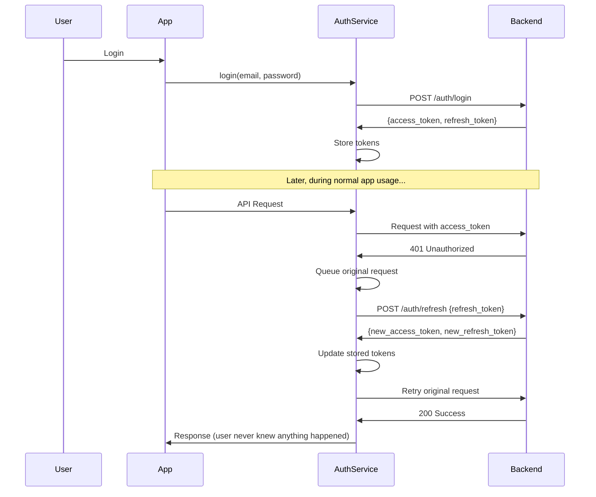

# Seamless Token Refresh Authentication Implementation

## 🎯 Overview

This implementation provides **completely transparent token refresh** where users never experience authentication interruptions. The system automatically handles token refresh in the background, just like your reference implementation.

## 🔧 Key Components

### **1. AuthService (Frontend)**

**File**: `palpalette-app/src/services/AuthService.ts`

**Key Features**:

- ✅ **Automatic token refresh** via axios interceptors
- ✅ **Request queuing** during refresh to prevent race conditions
- ✅ **Transparent to other services** - they just make requests normally
- ✅ **Device name tracking** for better session management
- ✅ **Secure token storage** using Capacitor Preferences

**How it works**:

```typescript
// When ANY request gets a 401 error:
1. Interceptor catches the 401 response
2. Queues the failed request
3. Automatically calls refresh token endpoint
4. Retries original request with new token
5. User never notices anything happened
```

### **2. Enhanced AuthContext (Frontend)**

**File**: `palpalette-app/src/contexts/AuthContext.tsx`

**Improvements**:

- ✅ **Simplified state management** - no manual refresh needed
- ✅ **Uses AuthService for all operations**
- ✅ **Cleaner error handling**
- ✅ **Better loading states**

### **3. Refresh Token Backend (Backend)**

**File**: `backend/src/modules/auth/auth.service.ts`

**New Features**:

- ✅ **Short-lived access tokens** (15 minutes)
- ✅ **Long-lived refresh tokens** (7 days)
- ✅ **Device name tracking**
- ✅ **Automatic token cleanup**
- ✅ **Proper token invalidation on logout**

## 🚀 User Experience

### **Before (Manual Refresh)**:

```
User makes request → 401 Error → Manual refresh → Retry request
                  ↑
              User sees error/loading
```

### **After (Seamless Refresh)**:

```
User makes request → 401 Error → Auto refresh → Auto retry → Success
                                      ↑
                              Completely invisible to user
```

## 🔒 Security Benefits

1. **Short Access Token Lifetime** (15 minutes)

   - Reduces exposure window if token is compromised
   - Forces regular refresh validation

2. **Refresh Token Rotation**

   - New refresh token issued on each refresh
   - Old refresh token immediately invalidated

3. **Device Tracking**

   - Each device gets its own refresh token
   - Easy to revoke access per device

4. **Automatic Cleanup**
   - Expired tokens automatically removed
   - Memory efficient token storage

## 📱 Implementation Details

### **Token Flow**:



### **Automatic Request Queuing**:

When a token refresh is in progress, all subsequent requests that also get 401 errors are **queued** rather than triggering additional refresh attempts. This prevents:

- Multiple simultaneous refresh calls
- Race conditions
- Token invalidation conflicts

## 🛠️ Usage Examples

### **Making API Calls (No Changes Needed)**:

```typescript
// Services can make requests normally - auth is completely transparent
const response = await axios.get("/api/devices/my-devices");
// If token expired, it's automatically refreshed and request retried
```

### **Using Auth in Components**:

```typescript
const { user, login, logout, loading } = useAuth();

// Login - gets both access and refresh tokens
const success = await login(email, password);

// Logout - invalidates all tokens
await logout();
```

### **Check Authentication Status**:

```typescript
const isAuthenticated = await authService.isAuthenticated();
```

## 🔄 Refresh Token Lifecycle

1. **Login**: User gets access token (15min) + refresh token (7 days)
2. **Normal Usage**: Access token used for all requests
3. **Token Expires**: First 401 triggers automatic refresh
4. **Refresh**: New access token + new refresh token issued
5. **Old Tokens**: Immediately invalidated for security
6. **Logout**: All tokens invalidated

## 📋 Backend Updates Required

### **New Dependencies**:

```json
{
  "uuid": "^10.0.0",
  "@types/uuid": "^10.0.0"
}
```

### **Updated Endpoints**:

```typescript
POST /auth/login
Body: { email, password, device_name? }
Response: { access_token, refresh_token, user }

POST /auth/refresh
Body: { refresh_token }
Response: { access_token, refresh_token, user }

POST /auth/logout
Headers: { Authorization: Bearer <token> }
Response: { success: true }
```

## ✨ Benefits Over Previous Implementation

1. **Zero User Friction**: Users never see token expiration
2. **Better Security**: Shorter token lifetimes with automatic refresh
3. **Cleaner Code**: No manual refresh logic scattered throughout app
4. **Race Condition Safe**: Request queuing prevents conflicts
5. **Device Awareness**: Better session management
6. **Memory Efficient**: Automatic token cleanup
7. **Error Recovery**: Graceful fallback to login if refresh fails

## 🚀 Testing the Implementation

1. **Login** to the app
2. **Wait 15+ minutes** (or modify token expiry for testing)
3. **Make any API request** (view devices, send colors, etc.)
4. **Observe**: Request completes successfully without any user intervention
5. **Check network tab**: You'll see the automatic refresh + retry

The user experience should be completely seamless! 🎉
