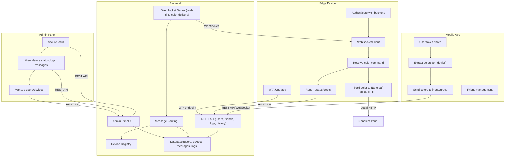

# PalPalette System Design Document

## Overview

PalPalette is a distributed system that allows friends to share colors with each other by taking photos, extracting colors, and displaying them on smart light panels (e.g., Nanoleaf) at their friends' locations. The system consists of a cross-platform mobile app, a backend server, edge devices at each location, and an admin panel for monitoring and management.

---

## Architecture Diagram

---

## Technology Choices

| Component   | Technology Choices                              | Notes                                |
| ----------- | ----------------------------------------------- | ------------------------------------ |
| Mobile App  | Ionic + React, Capacitor, JS/TS                 | Cross-platform, on-device processing |
| Backend     | Node.js (Express/NestJS), PostgreSQL, WebSocket | Self-hosted, scalable, open source   |
| Edge Device | ESP32/ESP8266, Arduino/C++                      | OTA, HTTP, WebSocket, Nanoleaf API   |
| Admin Panel | React (web), Auth (JWT/OAuth), REST API         | Restrict access, dashboard UI        |
| Database    | PostgreSQL (or SQLite for MVP)                  | Logs, users, messages, devices       |

---

## Component Responsibilities

### 1. Mobile App

- User login (simple for MVP, extensible later)
- Friend/group management (invite links, search)
- Take photo, extract dominant colors (on-device)
- Send color(s) to friend/group (via backend)
- View sent/received color history

### 2. Backend

- REST API for user/device management, logs, history
- WebSocket for real-time color delivery
- Device registry (which device belongs to which user)
- Message routing (app → backend → correct edge device)
- Store logs, messages, device status in DB
- Admin panel API

### 3. Edge Device

- Authenticates with backend (token-based)
- Maintains WebSocket connection for real-time commands
- Receives color, sends to Nanoleaf via local HTTP API
- Reports status/errors to backend
- Supports OTA firmware updates

### 4. Admin Panel

- Secure login (admin only)
- View device status, logs, message history
- Manage users/devices

---

## Communication Protocols

- **REST API:** For most CRUD operations (users, friends, logs, history)
- **WebSocket:** For real-time color delivery (app → backend → edge device)
- **HTTP (local):** Edge device to Nanoleaf
- **JWT:** For authenticating users and devices

---

## Prioritized Development Plan

1. **MVP Backend**
   - Set up Node.js backend, REST API, WebSocket server, simple DB schema (users, devices, messages)
2. **Edge Device Prototype**
   - ESP32/8266 firmware: connect to WiFi, authenticate, WebSocket client, simple Nanoleaf API call
3. **Mobile App MVP**
   - Ionic + React app: take photo, extract color, send to backend, basic friend management
4. **End-to-End Test**
   - Send color from app → backend → edge device → Nanoleaf
5. **Admin Panel MVP**
   - Simple web dashboard: device status, logs, message history
6. **Enhancements**
   - Friend search, group sharing, OTA updates, extensible device support, improved security, push notifications (future)

---

## Extensibility & Future Considerations

- Add support for more light panel brands by abstracting the edge device API
- Implement push notifications for received colors
- Enhance security (OAuth, 2FA, etc.)
- Open source release after initial private development
- Scale backend for larger user/device base

---

_This document serves as the foundation for the PalPalette system. Each section can be expanded with more technical detail as development progresses._
